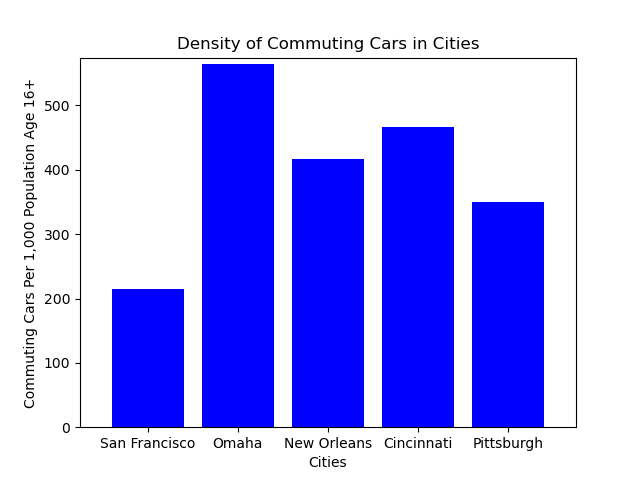

# Cars Bar Chart

In this activity, you will create a bar chart that visualizes the commuting cars per 1,000 population aged 16 and over  within major U.S. cities.

## Instructions

Using the [starter file](Unsolved/py_bars.ipynb), create a bar chart that matches the following image:

    

* Title: Density of Commuting Cars in Cities

* x-axis label: Cities

* x-tick labels: San Francisco, Omaha, New Orleans, Cincinnati, Pittsburgh

* y-axis label: Commuting Cars Per 1,000 Population Age 16+

Be sure to include space around the bars at the top and sides of the chart with the x- and y-axis limits.

## References

[2019 ACS 1-Year Estimates, Demographic and Housing Estimates](https://data.census.gov/cedsci/table?q=population%20of%20san%20francisco%20city%202019&t=001%20-%20Total%20population&g=1600000US0667000,2255000,3137000,3915000,4055000,4261000,5553000&tid=ACSDP1Y2019.DP05)

[2019 ACS 1-Year Estimates, Aggregate Number of Vehicles (Car, Truck, or Van) Used in Commuting by Workers 16 Years and Over by Sex](https://data.census.gov/cedsci/table?q=cars%20in%20cities&t=Populations%20and%20People&g=1600000US0667000,2255000,3137000,3915000,4055000,4261000,5553000_310XX00US14500&tid=ACSDT1Y2019.B08015)

---

© 2022 Trilogy Education Services, a 2U, Inc. brand. All Rights Reserved.
