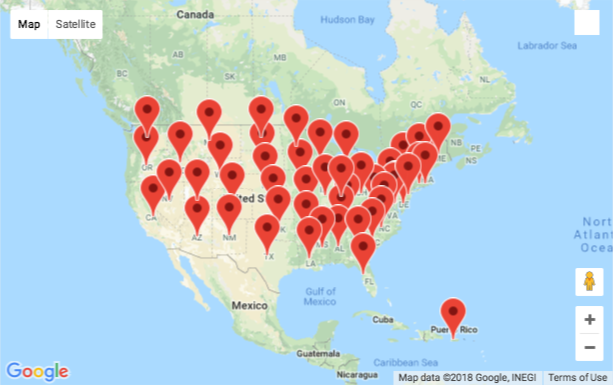

# Census Activity

In this activity, we will use the Census API to obtain state-level Census data.

## Instructions

* Using [Census_States.ipynb](Unsolved/Census_States.ipynb) as a reference, create a completely new script that calculates each of the following fields at the **state** level:

  * `Population`

  * `Median Age`

  * `Household Income`

  * `Per Capita Income`

  * `Poverty Count`

  * `Poverty Rate`

  * `Unemployment Rate`

* Save the resulting data as a CSV.

* Next, read in the provided CSV containing state centroid coordinates, and merge this data with your original Census data.

* With the coordinates now appended to the DataFrame, you can add markers to the base map.

  * Use the `Poverty Rate` column to create an `info_box` corresponding to each marker, as in the following image:

  

## Hint

  * Review the documentation for the [Census API Wrapper](https://github.com/datamade/census).

  * Review the documentation for [Jupyter Gmaps](http://jupyter-gmaps.readthedocs.io/en/latest/tutorial.html) for more information on how to create an `info_box`.

## References 

Data Source: [US Census Bureau](https://www.census.gov/developers/).

---

© 2022 Trilogy Education Services, a 2U, Inc. brand. All Rights Reserved.
