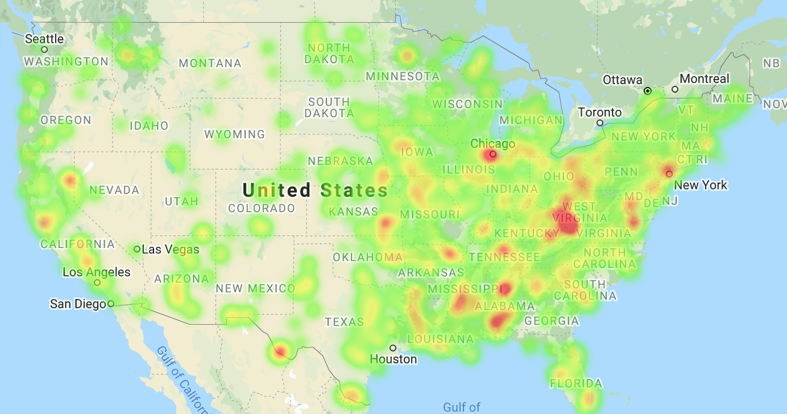
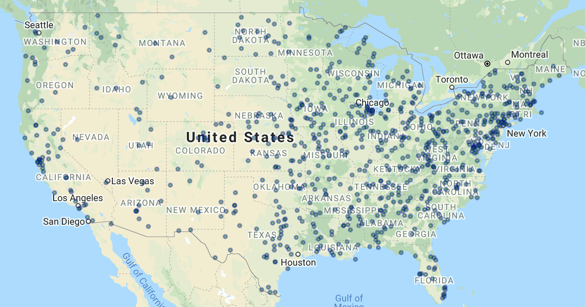
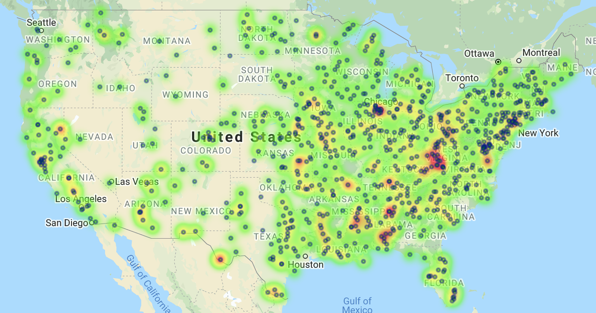

# Banking Deserts Heatmap

In this activity, your task is to understand if there is a relationship between poverty, age, and population and the number of banks in a given area. To help, we’ve provided you with Census data for every U.S. zip code. You will also visualize this data using Google Maps to create layered maps.

## Instructions

* Using [zip_bank_data.csv](Resources/zip_bank_data.csv) and your new knowledge of the U.S. Census API, add a column for `Poverty Rate` to the CSV.

* Using `gmaps`, create the following three figures:

  * A map with a `heatmap_layer` of the poverty rate for each city, as in the following image:
    

  * A map with a `symbol_layer` for the number of banks located in that city, as in the following image:
    

  * A map that includes both the poverty `heatmap_layer` and the bank `symbol_layer`, as in the following image:
    

* Print the summary statistics for `Poverty Rate`, `Bank Count`, and `Population`.

* Create a scatter plot with linear regression for **bank count** vs. **poverty rate**.

  * Be sure `NaN` values are dropped from the DataFrame.

  * Plot the data points.

  * Plot the linear regression line.

  * Print the R2 value.

* Write a sentence describing your findings. Were they what you expected? What other factors could be at play?

## Hint

* The Census API uses code B17001_002E for poverty rates.

* Test your code with only 5 to 10 cities at a time, debugging your code as you go.

* For reference, use the docs for the [layers](http://jupyter-gmaps.readthedocs.io/en/latest/api.html#figures-and-layers) and a [refresher](http://jupyter-gmaps.readthedocs.io/en/latest/tutorial.html) for setting up the maps.

* Be sure to handle zooming on the heatmap.

* At this point, you should not need to perform any new requests to Google's APIs.

* To format the info boxes on your `symbol_layer`, use string formatting with list comprehension.

## References

Data Source: Data generated by Trilogy Education Services, a 2U, Inc. brand, and is intended for educational purposes only. 

---

© 2022 Trilogy Education Services, a 2U, Inc. brand. All Rights Reserved.
