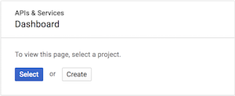
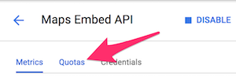
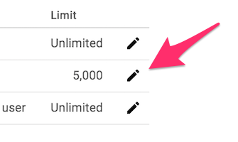

# Setting Google API Daily Usage Caps

Google provides a $200 credit for use of the Google Maps Platform, but they do require a credit card on file for charges beyond the $200 limit.

Avoid unexpected increases in usage limits by using the following instructions to set up a maximum daily billable limit for your API calls.

- - -

1. Visit the [Google Dashboard](https://console.cloud.google.com/projectselector/apis/dashboard?_ga=2.166576887.87610002.1528936935-349962923.1526573906&supportedpurview=project).

2. Select a project (if prompted), as in the following image:

  

3. Once you have selected a project, select an API from your API list and navigate to the **Quotas** tab, as in the following image:

  

  

4. Finally, click the **Edit** icon next to the "requests per day" quota to make the necessary changes, as in the following image:

  

* **Note**: These steps will need to be repeated for each API in use.

- - -

Full documentation regarding the pricing change can be found within this [Google FAQ](https://developers.google.com/maps/faq).

To set up a budget and/or billing alerts, visit the [Google Cloud Billing Documentation](https://cloud.google.com/billing/docs/how-to/budgets).

- - -

© 2022 Trilogy Education Services, a 2U, Inc. brand. All Rights Reserved.